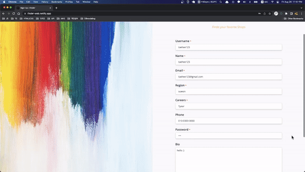
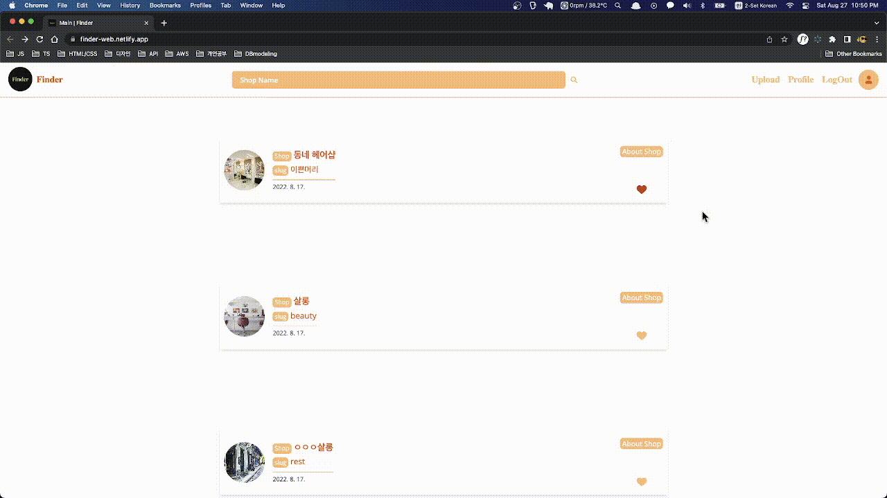
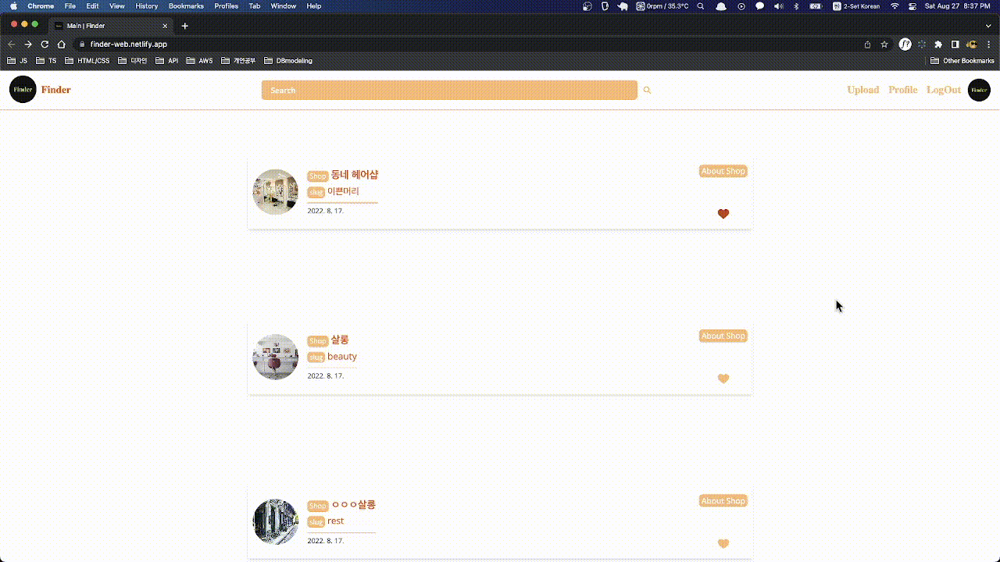
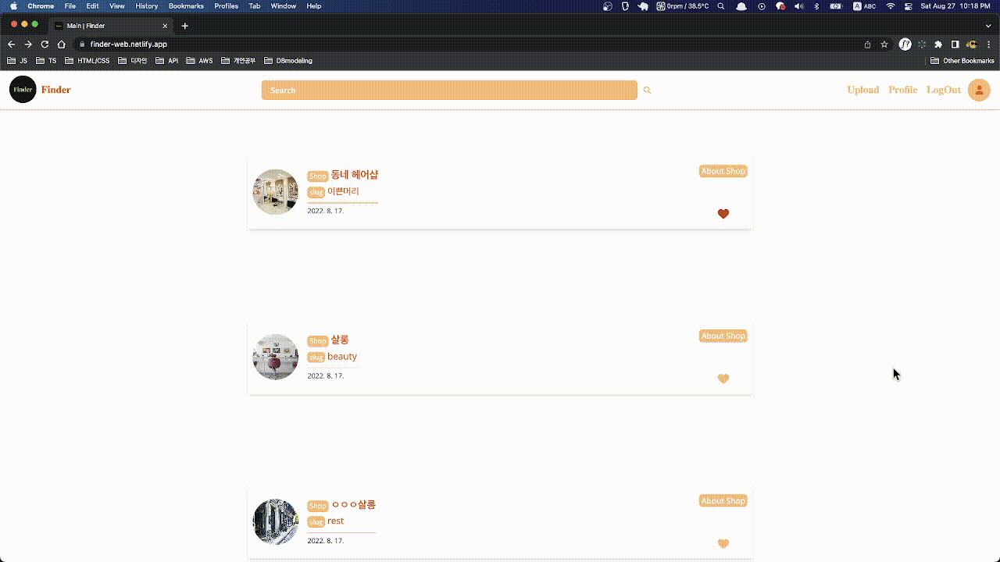
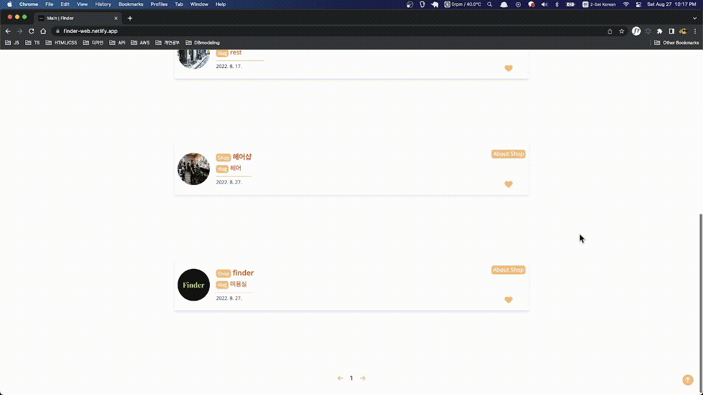
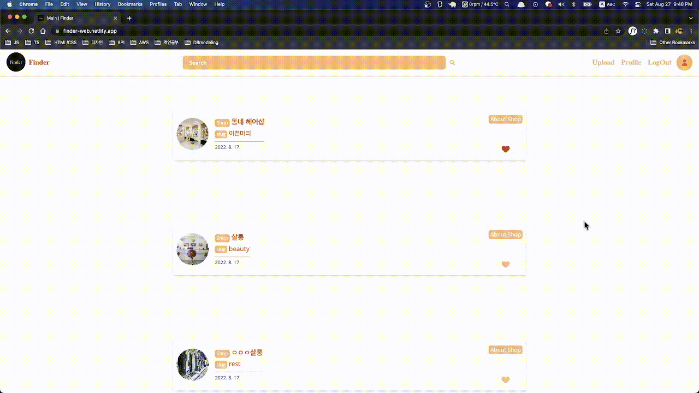

<div align="center">
    <br />
    <div>
       
    </div>
    <br /><br />
    <a display="block" href="https://finder-web.netlify.app/" >
      https://finder-web.netlify.app/
    </a>
    <br />
</div>

  </a>
</div>

## Content

- 🛠 [Built with](#built-with)
- 🚀 [Project](#project)
- 📖 [Pages](#pages)
- ✓ [Features](#features)
- 🔥 [Code](#code)
- 👍 [느낀점](#느낀점)

---

## Built with

### Front-end

- `React`
- `Typescript`
- `Styled-components`
- `Framer-motion`
- `React-hook-form`
- `Apollo-client`

### Back-end

- `Apollo-server`
- `Graphql`
- `Postgres`

### Deploy

- Client : `Netlify`
- Server : `Heroku`
- code : <a></a>

## Project

→ 마음에 드는 샵을 홍보하거나 탐색하는 등 여러사람이 모여 자유롭게 커뮤니케이션 하는 공간입니다.

✓ 모든 `이미지는 AWS S3`의 버킷에 저장됩니다.

> 네비게이션

- 로그아웃 또는 로그인(로그인 여부), 아바타가 있습니다.
- 아바타를 통해 유저 프로필을 확인할 수 있습니다.
- 업로드와 프로필을 확인할 수 있습니다.
  <br /><br />

> 1. 회원가입, 로그인

- 유저네임, 이름, 이메일, 지역, 커리어, 비밀번호를 입력하여 로그인 할 수 있습니다.
- 유저네임과 이메일은 필수조건이며, 중복이 불가하도록 하였습니다.(유니크)
- 비밀번호는 `bcrypt`를 사용하여 해시화 되고 DB에 저장됩니다.
- `jwt`를 통해 유저를 인증하여 로그인됩니다.
  <br></br>
  

> 2. Shops

- shop이름과 슬러그, 업로드일을 확인 할 수있습니다.
- shop 디테일페이지와 "좋아요"를 클릭 할 수 있습니다. (코드 ↓)

```typescript
// 해당 샵의 아이디를 fav로 뮤테이션합니다. (서버)
// 즉각적인 반응을 얻기 위해 아폴로 캐쉬를 변형하였습니다. (cache.modify)
const [fav, { loading }] = useMutation<FavToggleMutation>(FAV_TOGGLE_MUTATION, {
  update: favToggleUpdate,
});
const favToggleUpdate = (cache: ApolloCache<any>, result: any) => {
  const {
    data: {
      favsToggle: { ok },
    },
  } = result;
  if (ok) {
    cache.modify({
      id: `Shop:${id}`,
      fields: {
        isLike: (prev: any) => !prev,
      },
    });
  }
};
```

<br /><br />

> 3. 검색

- shop이름(제목)으로 검색을 할 수 있습니다.
- 관련된 shop들을 확인 할 수 있습니다.
  <br /><br />
  

> 4. 업로드

- 샵 정보  
  → 포토, 이름(제목), 슬러그, 지역, 전화번호 등을 입력하여 업로드 할 수 있습니다.
- `react-hook-form`을 활용하여 포토는 미리보기를 통해 업로드할 수 있습니다. (코드 ↓)

```typescript
const [preview, setPreview] = useState("");
const { watch } = useForm<IUploadForm>();
const image = watch("url");
useEffect(() => {
  if (image && image.length > 0) {
    const file = image[0];
    const imageFile = URL.createObjectURL(file);
    setPreview(imageFile);
  }
}, [image]);
```

<br /><br />


> 5. About Shop (상세정보)

- 샵 상세페이지에서 샵의 지역, 사이트, 전화번호 등 확인 할 수 있습니다.
- 업로드 한 유저네임을 클릭하여 유저의 프로필로 이동할 수 있습니다.
- 샵에서 게시한 포토를 확인할 수 있습니다.
- 샵에 대하여 유저들은 댓글을 게시 및 삭제를 할 수 있습니다.
- 해당 `샵 유저`라면 사진을 업로드 할 수 있습니다.
- 해당 `샵 유저`라면 샵 수정페이지로 이동할 수 있습니다.
  <br /><br />
  

> 6. Edit Shop (샵 수정)

- 샵 정보  
  → 이름(제목), 슬러그, 지역, 전화번호 등을 수정할 수 있습니다.
- 샵의 이름(제목), 슬러그는 유니크하게 설정됩니다.
- 미리보기를 통해 샵의 포토를 확인 할 수 있습니다.
- 변경한 포토가 메인 포토로 설정됩니다.
- 샵의 포토를 변경할 수 있고 삭제 할 수 있습니다.  
  → 삭제할 경우 기본 배경으로 설정됩니다.
- 샵을 삭제할 수 있습니다.
  <br /><br />
  

> 7. 프로필

- 유저는 유저가 게시한 샵과 "좋아요"한 샵을 확인할 수 있습니다.
- 자신을 "팔로워"한 유저를 확인할 수 있습니다.
- 해당 유저(로그인한 자기자신)만 프로필 수정페이지로 이동할 수 있습니다.
- 다른 유저들이 "팔로워"할 수 있습니다.
  <br /><br />

> 8. 프로필 수정

- 유저의 아바타와 유저의 정보를 수정할 수 있습니다.
- 미리보기를 통해 아바타를 변경할 수 있습니다.
  <br /><br />
  

> 9. 기타 훅 (share)

- useUser hook : 로그인된 사용자를 확인하는 훅

```typescript
const useUser = ({ isPrivate }: UseUserProps) => {
  const navigate = useNavigate();
  const { loading, error, data } = useQuery<Me>(ME_QUERY);

  useEffect(() => {
    if (isPrivate && !data?.me) {
      navigate("/", { replace: true });
      return;
    }
  }, [data?.me, isPrivate, navigate]);

  return { loading, error, user: data?.me };
};
```

<br />

- pagination : 페이지 구분 구현

```typescript
const Pagination: React.FC<PaginationProps> = ({
  totalLength,
  setPage,
  page,
}) => {
  const totalPage = totalLength ? totalLength : 1;
  const offset = 5;

  const onNext = () => {
    setPage((prev) => (totalPage < offset ? prev : prev + 1));
  };

  const onBack = () => {
    setPage((prev) => (prev === 1 ? 1 : prev - 1));
  };
```

<br />

- WindowSize : 윈도우 사이즈 변경 - 반응

```typescript
const WindowSize = () => {
  const [windowSize, setWindowSize] = useState(0);

  const handleSize = useCallback(() => {
    setWindowSize(window.innerWidth);
  }, []);

  useEffect(() => {
    window.addEventListener("resize", handleSize);
    return () => {
      window.removeEventListener("resize", handleSize);
    };
  }, [handleSize, windowSize]);

  useEffect(() => {
    setWindowSize(window.innerWidth);
  }, []);

  return { windowSize };
};
```

<br />

## Pages

- 회원가입
- 로그인

> 홈

- 업로드된 샵
- 업로드 샵
- 검색

> shop

- 상세페이지
- 샵 수정
- 업로드 포토
- 댓글 생성 및 삭제

> User

- 프로필
- 프로필 수정
  <br><br/>

## Features

### 🌈 Shop

- Info
- 게시한 포토
- 댓글 게시 및 삭제
- 업로드 포토
- 샵 수정 (포토 미리보기, 삭제)
  <br />

### 🙋‍♂️ User

- 회원가입 / 로그인
- 아바타 업로드 (포토 미리보기)
- 프로필 수정 (포토 미리보기, 삭제)
- 회원정보 변경
  <br />

## Code

<a href="https://github.com/jangth0655/finder-client">🔥 GitHub</a>

<br /><br />

## 느낀점

```
클라이언트 부분에서 느낀점..
익숙한 REST와 달리  apollo client를 활용하고 graphql을 통해 데이터를 받아오는 점에서 흥미로웠고 재밌었습니다. 하지만 앱을 구현에 있어서 익숙치 않아서 어려움점이 있었습니다.
특히 아폴로 캐쉬를 조작하는 과정에서 fragment와 modify를 활용하는 어려움이 있었습니다.
그래서 공식문서를 자세히 읽어보며(예제와 설명) 적용해나갔고, 부족한 부분은 구글링을 통해서 해결해 나갔습니다.
이번 finder(앱이름)를 통해 graphql를 활용하여 서버와 데이터를 주고받는 것에 조금 익숙해지고,
알게 되었으며 캐쉬를 조작하여 좀 더 빠른 앱을 만들 수 있다는 것을 배웠습니다.
```
